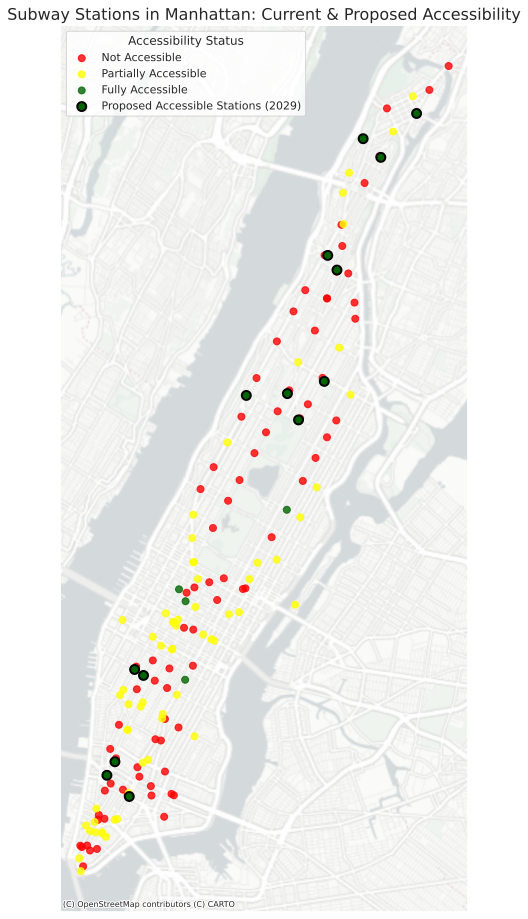

# Mapping Disability and Subway Accessibility in New York City
### Credit
Andrew Zuppardi Command-Line GIS
### Description
My final project is focused on exploring how accessible New York City’s subway stations are for working-age adults with disabilities. One of my goals for this project was to evaluate the accessibility of the current stations throughout Manhattan to determine whether the distribution of accessible subway stations appears to be equitable. An important piece of context for this project is that some subway stations are Fully Accessible (ADA accessible in both directions) while others are Partially Accessible (ADA accessible in one direction). 

To answer this question, I used multiple geoprocessing tools including buffers, unary unions, and difference overlays to create walksheds for Accessible Hubs (regions that included both Fully Accessible and Partially Accessible stations) along with a walkshed for gap areas that did not contain accessible stations. These are shown on a static map which also includes the percentage of working-age disabled adults located within each NTA (Neighborhood Tabulation Area). In addition, I created a choropleth map which shows the percentage of accessible stations in each neighborhood (NTA).

Next, I performed a similar analysis again but included future planned accessible stations to check which neighborhoods in Manhattan would benefit from increased accessibility and to note which ones need to be targeted for future improvements.

Finally, I conducted a network analysis using isochrone buffers to determine how many disability-friendly employers could be reached within a reasonable commute time from stations which were at least Partially Accessible. This analysis is an important part of reviewing the accessibility of the subway system because disabled users need convenient access to job locations. I chose to present this analysis as an interactive webmap which contains the employers that can be reached within reasonable commute times along with the Accessible Hubs and the Gap Areas.

One of the main datasets that I used for this project was a .csv from Data.gov (updated November 15, 2025) which contained MTA subway stations categorized by ADA accessibility status. I did not have to do much additional tweaking to make this data mappable as it already contained latitude and longitude. I also used a list of employers in NYC highlighted for hiring disabled employees that I assembled from two different job websites and then geocoded.

### Network Analysis of Disability-Friendly Employers Reachable from Accessible Subway Stations, Manhattan
<iframe src="commute_jobsites_ver2.html" height="800" width="900"></iframe>

Explore this map [here](commute_jobsites.html).
Map by Andrew Zuppardi

### Results
Overall, neighborhoods in northern Manhattan generally had a lower percentage of accessible stations when compared to neighborhoods south of Central Park, and this trend matched the gaps in accessibility calculated using a walkshed analysis.

East Harlem and Hamilton Heights both appear to have noticable gaps in conveniently reachable accessible stations, even though both neighborhoods have high populations of disabled working-age residents. These results are consistent with the MTA's ongoing efforts to increase subway accessibility throughout the city, with Randall's park also has a lack of accessible stations, but that neighborhood is unique because it is an island with no subway stations. This means that evaluating whether there is generally equitable transit access for disabled adults on the island would likely require an analysis of Access-A-Ride availalbility for the neighborhood. While the Lower East Side also had a noticable gap in accessible stations due to a lack of stations, the overall impact on transit equity may lower for that neighborhood due to relatively quick bus access to accessible station in other neighborhoods. 

The planned station improvements by the MTA appear to do a fair job at addressing the gap in accessible stations for parts of Hamilton Heights and East Harlem, and it is also great that all of Harlem would be included within an accessible walkshed after the planned stations are completed. However, the current plan may be overinvesting in accessible stations for Lower Manhattan, as neighborhoods in that area generally have a lower percentage of disabled residents and already had some accessible stations located close by.

Another result that I thought was interesting was that many of the disability-friendly employers I was able to locate within Manhattan appeared to be for technical positions and higher-skills roles from companies which are likely interested in promoting acceptance for disabled communities as a core value. Since many of these companies are located in or near the Accessible Hubs, it may suggest that gaps in the network of accessible subway stations may deter innovative start-ups and technical companies from choosing to relocate to those neighborhoods. If this were to be the case, then aggressively retrofitting subway stations in Manhattan needs to be made a higher budget priority at both the city and the state level. This would help to ensure that New York City can remain economically competitive and increase access to opportunities in innovative fields to disabled residents. 
